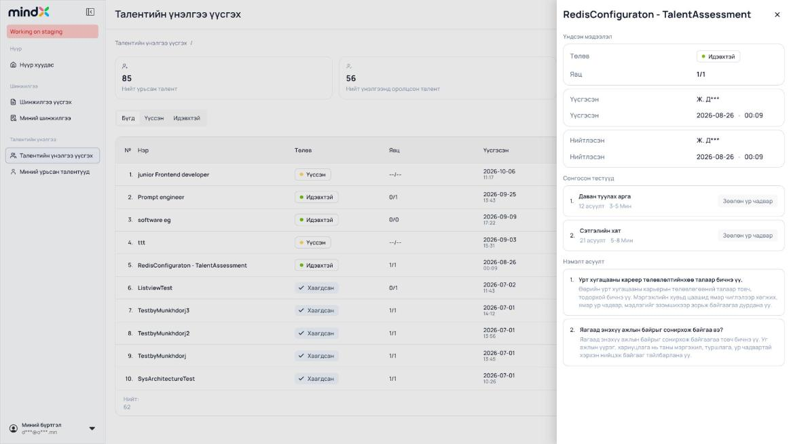
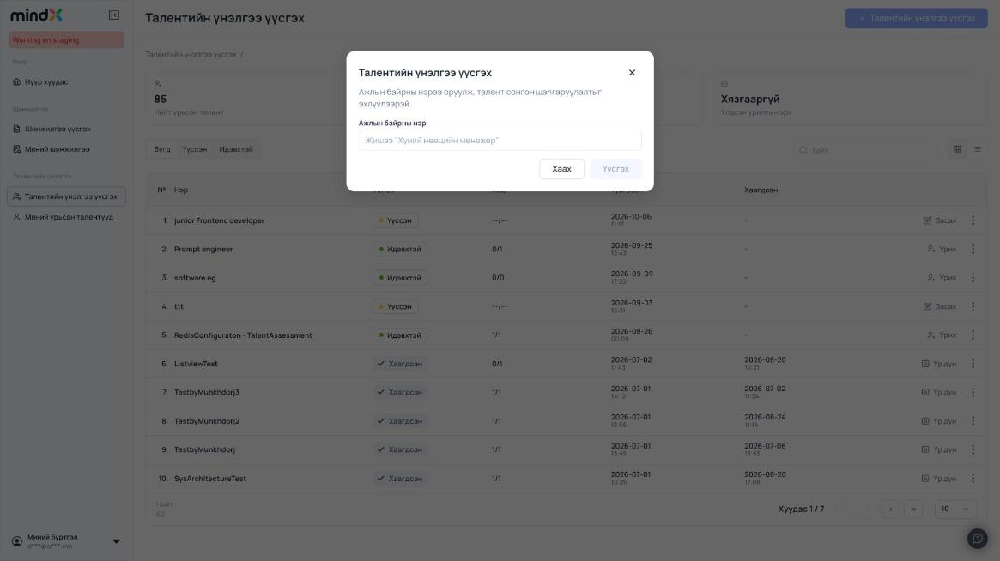
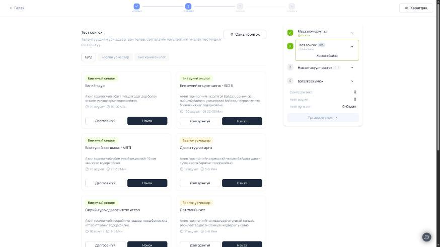
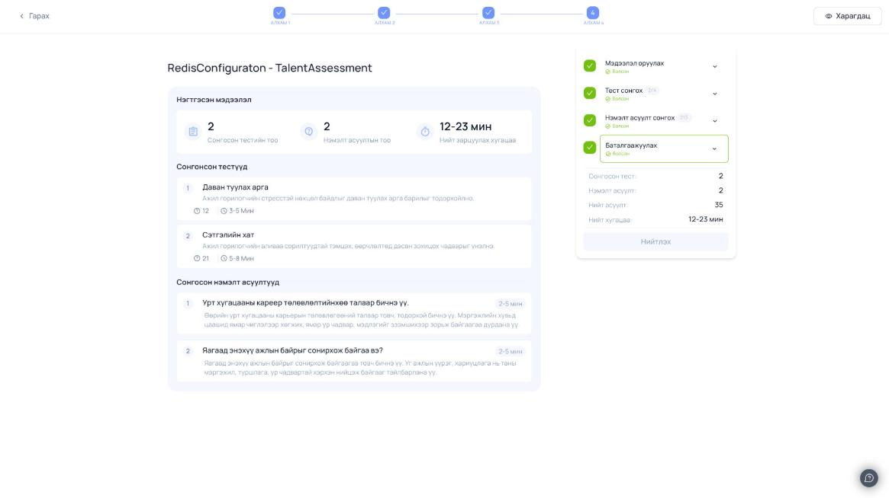
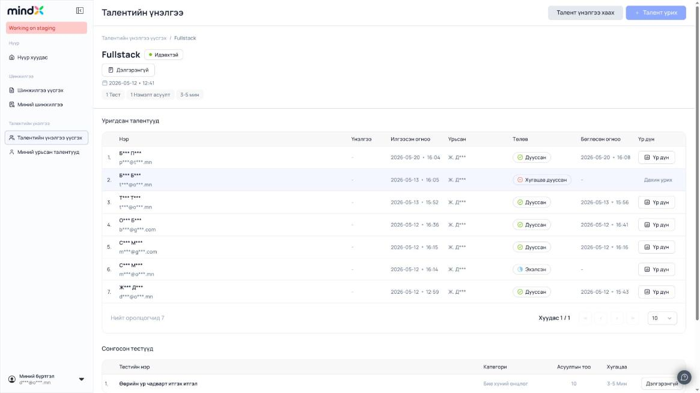
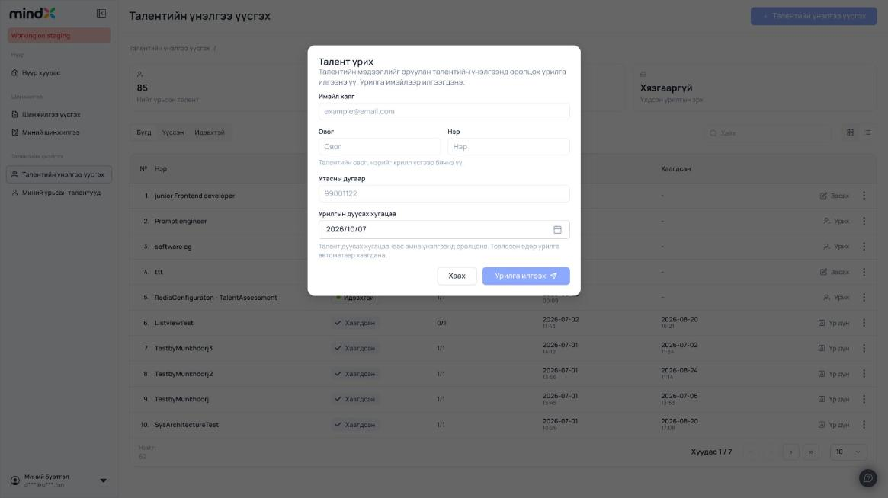
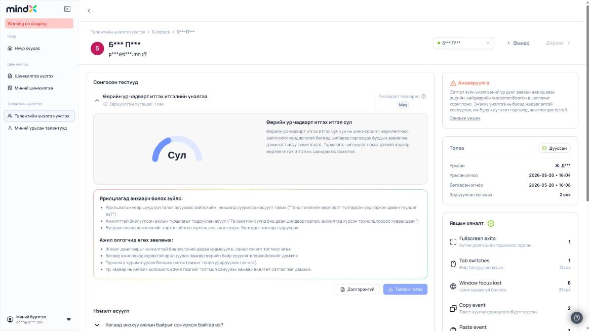
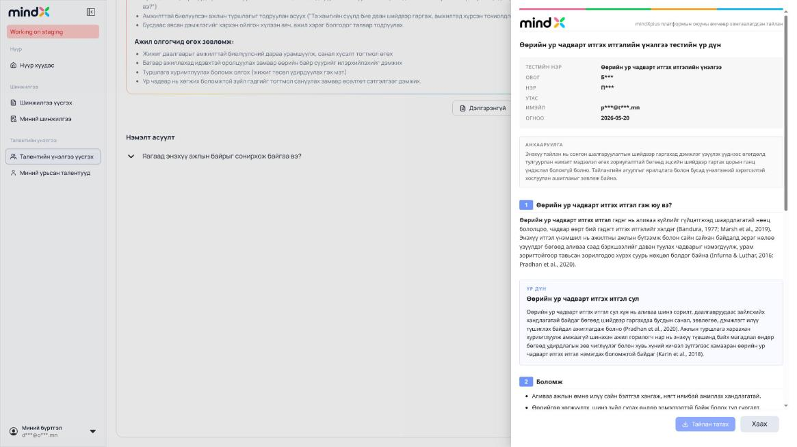

# "Талентийн үнэлгээ" (Role Assessment) — судалгааны тайлан

- **Огноо:** 2026-10-06
- **Орчин:** `https://app-staging.mindxplus.com` (staging), customer эрхээр нэвтэрсэн (`userProfile.role = OWNER`, `accountInfo.planType = PREMIUM`)
- **Хамрах хүрээ:** `/role-assessment` болон түүнээс гарах бүх дэд route, мөн sidebar-ийн ижил хэсэгт байгаа `/invited-talents`
- **Кодонд өөрчлөлт:** хийгээгүй. Энэ файл болон `docs/role-assessment/screenshots/` л нэмэгдсэн.

## 0. Аргачлал, тэмдэглэгээ, аюулгүй байдал

**Аргачлал**
1. Хуудсанд `window.fetch` + `XMLHttpRequest`-ийг patch хийж method / URL / query / header-ийн **нэр** / body / status / response-г массивт log хийсэн. Хуудас хооронд `window.next.router.push()`-ээр client-side шилжсэн тул patch бүтэн хугацаанд хадгалагдсан.
2. Response-ийг шууд хуулахгүй, **schema** болгон хувиргасан (түлхүүр + төрөл + маскалсан жишээ).
3. Бичих (POST) үйлдлүүдийг илгээхгүйгээр, апп-ын ачаалсан JS chunk-уудыг (`/_next/static/chunks/...`) татаж уншиж endpoint, method, body-г гаргасан.

**Тэмдэглэгээ**
| Тэмдэг | Утга |
|---|---|
| ✅ | **Ажигласан**: апп-ын илгээсэн бодит хүсэлт/хариугаар батлагдсан |
| 📦 | **Bundle-ээс**: JS chunk-ийн кодоос уншсан, бодит хүсэлтээр батлагдаагүй |
| ❓ | **Таамаг**: шууд нотолгоо байхгүй |

**Аюулгүй байдлын тайлан**
- Бичих хүсэлт (POST) **0** удаа явсан. "Үүсгэх", "Үргэлжлүүлэх", "Нийтлэх", "Урилга илгээх", "Дахин урих", "Үнэлгээ өгөх", "Хадгалах", "Устгах", "Хаах" товчнуудыг **дараагүй**.
- Урих modal-ын имэйл талбарт юу ч бичээгүй, учир нь onBlur үед `POST /customer/hiring-invitations/search-by-email` явдаг 📦.
- "Тайлан татах" (файл татах) товчийг дараагүй; энэ хэсгийг bundle-ээс тодорхойлсон.
- Таамгаар хийсэн хүсэлт ердөө **1**: алдааны бүтцийг шалгахын тулд апп-аар `/role-assessment/00000000-0000-0000-0000-000000000000/dashboard` нээхэд апп өөрөө 2 GET илгээж, хоёулаа 404 буцсан. Rate-limit/401 гараагүй.
- Token, cookie-ийн утгыг хуулаагүй (`<redacted>`). Хувийн мэдээллийг маскалсан. Screenshot-уудыг авахаас өмнө DOM дээр нэр/имэйлийг маскалсан.

---

## 1. Sitemap / навигаци

Sidebar ("Талентийн үнэлгээ" бүлэг):
- **Талентийн үнэлгээ үүсгэх** → `/role-assessment`
- **Миний урьсан талентууд** → `/invited-talents`

| Route (URL pattern) | Next.js segment ✅ | Дэлгэц | Хаанаас орох |
|---|---|---|---|
| `/role-assessment?page={1..}&size={n}` | `app/(dashboard)/role-assessment/page` | Үнэлгээнүүдийн жагсаалт | Sidebar. `page` нь **1-ээс эхэлнэ** (API-д `page-1` болж очно) |
| `/role-assessment/{recruitmentId}` | `app/(editor)/role-assessment/[id]/page` | Үүсгэх/засах wizard (4 алхам) | CREATED мөрийн нэр, "Засах" цэс, үүсгэсний дараах redirect. PUBLISHED үед зөвхөн унших горим |
| `/role-assessment/{recruitmentId}/preview` | `app/(editor)/role-assessment/[id]/preview/page` | Оролцогчид харагдах эхлэх хуудасны preview | Wizard-ийн "Харагдац" (шинэ tab) |
| `/role-assessment/{recruitmentId}/dashboard` | `app/(dashboard)/role-assessment/[id]/dashboard/page` | Нэг үнэлгээний дэлгэрэнгүй, урьсан талентууд | PUBLISHED/CLOSED мөрийн нэр, "Үр дүн" |
| `/role-assessment/{recruitmentId}/dashboard/{invitationId}` | `.../dashboard/[invitationId]/page` | Нэг талентын үр дүн/тайлан | Dashboard дээрх нэр эсвэл "Үр дүн" |
| `/invited-talents` | `app/(dashboard)/invited-talents/page` | Урьсан талентууд (card) | Sidebar |
| `/invited-talents/{talentId}` | (ижил бүлэг) | Талентын урилгын түүх | "Үзэх" |
| `/membership` | — | Багц | `plan_expired` modal-ын "Багцтай танилцах" 📦 |

URL-гүй, дотоод төлөвт (state) хадгалагддаг хэсгүүд:
- Жагсаалтын status tab-ууд **Бүгд / Үүссэн / Идэвхтэй**. **Хаагдсан гэсэн tab байхгүй**, CLOSED-ууд зөвхөн "Бүгд" дотор харагдана.
- Grid/List харагдацын сэлгүүр, хайлт.
- Wizard-ийн алхам (АЛХАМ 1–4) URL-д ордоггүй. Зөвхөн document title өөрчлөгдөнө: `Талентийн үнэлгээ - Мэдээлэл оруулах / Тест сонгох / Нэмэлт асуулт сонгох / Баталгаажуулах`.

---

## 2. Дэлгэц тус бүр

### 2a. Үнэлгээнүүдийн жагсаалт — `/role-assessment`



**Ачаалах үед:** `GET /customer/recruitments/?page=0&size=10` ✅ болон `GET /customer/recruitments/statistics` ✅

- **Статистикийн 3 карт** ✅: Нийт урьсан талент (`totalInvitationCount`), Нийт үнэлгээнд оролцсон талент (`totalCompletedCount`), Үлдсэн урилгын эрх (`invitationBalance`). Үлдсэн эрх **≥ 10000** бол "Хязгааргүй" гэж харуулна 📦. Staging-д 100408 ирж, "Хязгааргүй" гэж харагдсан ✅.
- **Status tab** ✅: Бүгд (status param-гүй), Үүссэн (`status=CREATED`), Идэвхтэй (`status=PUBLISHED`). Tab эсвэл хайлт өөрчлөгдөхөд `page=1` болно 📦.
- **Хайлт** "Хайх": `name` query param, `maxLength=100`. **Debounce байхгүй**, товч бүр дээр react-query key өөрчлөгдөж шинэ хүсэлт явна 📦.
- **Эрэмбэлэлт:** UI-д байхгүй. API хариунд `sort.unsorted=true`; ажигласнаар `createdAt` буурах дарааллаар ирдэг ❓.
- **Хүснэгт (List view)** ✅: `№` · `Нэр` · `Төлөв` · `Явц` (`completed/total`, CREATED үед `--/--`) · `Үүсгэсэн` (огноо+цаг) · `Хаагдсан` · `Үйлдэл`
- **Card (Grid view)** 📦: нэр, төлөв, явцын % (`completed/total*100`), огноо, үйлдэл.
- **Status badge** ✅: `CREATED` → "Үүссэн" (шар цэг), `PUBLISHED` → "Идэвхтэй" (ногоон цэг), `CLOSED` → "Хаагдсан" (✓ тэмдэгтэй).
- **Мөр дээр дарахад** 📦: CREATED бол `/role-assessment/{id}`, бусад үед `/role-assessment/{id}/dashboard` руу орно.
- **Inline товч** ✅: CREATED → "Засах", PUBLISHED → "Урих", CLOSED → "Үр дүн".
- **⋮ цэс** ✅ (зөвхөн байгааг тэмдэглэсэн, дараагүй):
  - CREATED: Дэлгэрэнгүй · Засах · Устгах (баталгаажуулах modal: "Талентийн үнэлгээг устгахдаа итгэлтэй байна уу?")
  - PUBLISHED: Урих · Үр дүн · Дэлгэрэнгүй · Талентийн үнэлгээ хаах (баталгаажуулах modal-тай)
  - CLOSED: Үр дүн · Дэлгэрэнгүй
- **Нэр солих** 📦: CREATED мөрийн нэр дээр hover хийхэд харандаа icon гарна. Modal "Сонгон шалгаруулалт нэр солих", `maxLength=100`.
- **Хуудаслалт** ✅: page/size (offset). URL-д `?page=N` (1-ээс эхэлнэ), API-д `page=N-1`. Хуудасны хэмжээ сонгох select (10), «  ‹  ›  » товчнууд, "Хуудас X / Y", "Нийт: N". `page > totalPages` бол сүүлийн хуудас руу автоматаар шилжүүлнэ 📦.
- **Хоосон төлөв** 📦: "Танд үүсгэсэн талентийн үнэлгээ байхгүй байна." + "Ажлын байрны нэрээ оруулж, талент сонгон шалгаруулалтыг эхлүүлээрэй."
- **Ачааллах үед** 📦: skeleton / "Ачааллаж байна...". **Алдаа гарвал** toast "Талентийн үнэлгээний жагсаалт авахад алдаа гарлаа".

**"Дэлгэрэнгүй" drawer** (`GET /customer/recruitments/{id}` ✅):
- Үндсэн мэдээлэл: Төлөв, Явц, Үүсгэсэн (хэн + огноо), Нийтлэсэн (хэн + огноо), Хаасан (хэн + огноо)
- Сонгосон тестүүд: нэр, "N асуулт", "min-max Мин", категорийн chip
- Нэмэлт асуулт: асуулт + тайлбар
- Хоосон үед: "Та тест сонгоогүй байна." / "Та нэмэлт асуулт сонгоогүй байна."

### 2d. "Үнэлгээ үүсгэх" wizard

#### Алхам 0 — Үүсгэх modal (жагсаалт дээр)



- Талбар: **"Ажлын байрны нэр"** (заавал, `maxLength=100`, placeholder `Жишээ "Хүний нөөцийн менежер"`). Хоосон үед "Үүсгэх" идэвхгүй, toast "Гарчиг оруулна уу" 📦.
- "Үүсгэх" дарахад `POST /customer/recruitments/new` body `{"str": "<нэр>"}` явна 📦. Хариу нь **шууд id string** гэж кодоос харагдаж байна (`router.push("/role-assessment/" + response)`) 📦❓. Дараа нь toast "Талентийн үнэлгээ амжилттай үүслээ" гарч wizard руу шилжинэ.
- ⛔ **Энд зогссон.** Энэ товч staging дээр шинэ CREATED ноорог үүсгэдэг тул дараагүй. Wizard-ийн алхмуудыг байгаа CREATED ноорог болон PUBLISHED үнэлгээ дээр (зөвхөн унших горимоор) судалсан.

#### Wizard-ийн бүтэц — `/role-assessment/{id}`

- Дээд хэсэг: "‹ Гарах" (→ `/role-assessment`), stepper АЛХАМ 1–4, "Харагдац" (→ `/preview`, шинэ tab).
- Баруун самбар: алхмын жагсаалт (Болсон / Хийж байна), `Тест X/4`, `Асуулт Y/3` тоолуур, нэгтгэл (Сонгосон тест, Нэмэлт асуулт, Нийт асуулт, Нийт хугацаа `min-max мин`), үндсэн товч **"Үргэлжлүүлэх"** (4-р алхамд **"Нийтлэх"**).
- **Ачаалах үед** ✅: `GET /customer/designs/RECRUITMENT/{id}`, `GET /customer/recruitments/{id}`, `GET /customer/recruitment-setup/{id}/information`, `GET /customer/recruitment-setup/settings` (→ `{maxTestCount: 4, maxQuestionCount: 3}`)
- **"Үргэлжлүүлэх" алхам бүрт хадгална** 📦 (тиймээс дараагүй):
  | Алхам | Хүсэлт | Body |
  |---|---|---|
  | 1 | `POST /customer/recruitment-setup/{id}/update-information` | `{jobTitle, jobDescription, companyName, companyDescription}` |
  | 2 | `POST /customer/recruitment-setup/{id}/set-tests` | `["<catalogTestId uuid>", ...]` (raw array) |
  | 3 | `POST /customer/recruitment-setup/{id}/set-questions` | `[<questionId number>, ...]` (raw array) |
  | 4 | `POST /customer/recruitment-setup/publish` | `{"str": "<recruitmentId>"}` |
- **Алхам хооронд шилжих дүрэм** 📦: Баруун самбарын алхам дээр дарахад хадгалахгүйгээр шилжинэ. Гэхдээ зөвхөн дараах тохиолдолд: өмнөх/дууссан алхам руу; эсвэл мэдээлэл серверт хадгалагдсан бөгөөд хадгалаагүй өөрчлөлтгүй үед дараагийн алхам руу. 2→3 шилжихэд тест сонгоогүй бол "Тест сонгоно уу". PUBLISHED үед бүх алхам зөвхөн унших горимтой, товчнууд идэвхгүй.

#### Алхам 1 — Мэдээлэл оруулах ✅
- **Ерөнхий мэдээлэл оруулах:** "Ажлын байрны нэр*" (`jobTitle`), "Нэмэлт мэдээлэл *" (`jobDescription`, rich-text: Normal/B/I/U/link/жагсаалт/clear → **HTML string**, жишээ `"<p>…</p>"`).
- **Компанийн танилцуулга:** "Компанийн нэр" (`companyName`; UI дээр `*` байхгүй ч **үргэлжлүүлэх товч идэвхжихэд заавал** 📦), "Компанийн тухай" (`companyDescription`, HTML, сонголттой).
- **Лого:** PNG/JPEG, ≤200KB. Validation мессеж: "Зураг 200KB-аас хэтэрч болохгүй!", "Зөвхөн PNG, JPEG формат зөвшөөрөгдөнө!". Файл сонгогдмогц шууд `POST /customer/designs/RECRUITMENT/{id}/upload-logo` (multipart `logo`) явна; устгахад `.../remove-logo {id}` 📦.
- "Үргэлжлүүлэх" идэвхжих нөхцөл: `jobTitle`, `jobDescription`, `companyName` хоосон биш байх 📦.
- Бичсэн ноорог `localStorage["ra_draft_{id}"]`-д автоматаар хадгалагдана 📦.

#### Алхам 2 — Тест сонгох ✅



- Хүсэлтүүд ✅: `GET /customer/role-assessments/categories`, `GET /customer/role-assessments/tests?category=` (Бүгд үед хоосон) / `?category=hiring_soft_skill`, `GET /customer/recruitment-setup/{id}/tests` (→ сонгосон **catalog `id`**-уудын массив, `testId` биш ✅).
- Ангиллын tab: **Бүгд · Зөөлөн ур чадвар (`hiring_soft_skill`, YELLOW) · Бие хүний онцлог (`hiring_individual`, GREEN)**
- Card дээр: категорийн chip, нэр, тайлбар, "N асуулт", "min-max Мин", **"Дэлгэрэнгүй"** (drawer: `GET /customer/role-assessments/tests/{id}` ✅ → `content` HTML; доор нь "Тест нэмэх"), **"Нэмэх" / "Нэмсэн"**. Сонгосон card дээр дарааллын дугаар гарна.
- Хязгаар: `maxTestCount` (=4). Хэтэрвэл toast "Таны хязгаар дүүрсэн байна".
- **"Санал болгох" modal** ✅ (илгээгээгүй): 3 radio асуулт, бүгд заавал. Сонголтын утгууд 📦:
  1. "Та бөлгөж буй сонгон шалгаруулалт аль түвшний ажлын байр вэ?" → `entry` | `senior` | `manager`
  2. "…гол зорилго ямар чадварт илүү төвлөрдөг вэ?" → `execution` | `leadership` | `strategy`
  3. "…ямар төрлийн зөөлөн ур чадвар…?" → `self-discipline` | `teamwork` | `strategic`

  "Санал болгох" дарахад `POST /customer/role-assessments/recommend` body = `["entry","execution","teamwork"]` (raw array) 📦. Хариунаас `answerIds|answer_ids` болон `tests|content|array`-г уншаад эхний `maxTestCount` тестийг автоматаар сонгоно 📦.
- **Тестийн каталог** (staging, 10 тест ✅): Багийн дүр (Бие хүний онцлог, 39 асуулт, 15-20 мин) · Бие хүний онцлог шинж – BIG 5 (100, 20-30) · Бие хүний хэв шинж – MBTI (70, 20-30) · Даван туулах арга (Зөөлөн ур чадвар, 12, 3-5) · Өөрийн ур чадварт итгэх итгэл (Бие хүний онцлог, 10, 3-5) · Сэтгэлийн хат (ЗУЧ, 21, 5-8) · Сэтгэл хөдлөлийн чадамж (ЗУЧ, 28, 10-15) · Харилцааны ур чадвар (ЗУЧ, 20, 8-10) · Хариуцлагын итгэл үнэмшил (БХО, 18, 5-8) · Хувийн болон нийгмийн хариуцлага (ЗУЧ, 8, 3-5)

#### Алхам 3 — Нэмэлт асуулт сонгох ✅
- Хүсэлтүүд ✅: `GET /customer/role-assessments/question-categories`, `GET /customer/role-assessments/questions?category=`, `GET /customer/recruitment-setup/{id}/questions` (→ `[9,10]` гэх мэт **number** массив).
- Ангилал ✅: Бүгд · Ерөнхий, суурь (`q_background`) · Ур чадвар, туршлага (`q_skills`) · Ажиллах арга барил (`q_work_style`) · Зан төлөв (`q_behaviour`) · Компанийн соёл (`q_culture`). Нийт 25 асуулт.
- Checkbox жагсаалт: асуулт, тайлбар, "2-5 мин". Хязгаар `maxQuestionCount` (=3). Нэг ч асуулт сонгохгүй байж болох бололтой 📦.

#### Алхам 4 — Баталгаажуулах (эцсийн товчны өмнөх төлөв) ✅



- Нэгтгэсэн мэдээлэл: Сонгосон тестийн тоо, Нэмэлт асуултын тоо, Нийт зарцуулах хугацаа (тестүүдийн min/max нийлбэр). Мөн "Сонгонсон тестүүд" (нэр, тайлбар, асуултын тоо, хугацаа) болон "Сонгосон нэмэлт асуултууд".
- **"Нийтлэх"** → `POST /customer/recruitment-setup/publish {str: id}` 📦. Амжилттай бол modal "Хүсэлт амжилттай илгээгдлээ." / "Таны талентийн үнэлгээ амжилттай үүслээ. Одоо талентүүдэд урилга илгээж…" / "Талентийн үнэлгээ рүү очих" → `/dashboard`.
- ⛔ Screenshot нь PUBLISHED үнэлгээн дээр авсан тул "Нийтлэх" идэвхгүй харагдаж байна. Дараагүй.

**Урилга илгээх арга, хугацаа:** Wizard-д урилгын алхам **байхгүй**. Урилгыг нийтэлсний дараа жагсаалт эсвэл dashboard дээрх "Урих" modal-аар **нэг удаад нэг имэйл** илгээнэ. Имэйлийн жагсаалт, файл импорт, нийтийн холбоос гэх мэт арга **олдоогүй** (✅ UI, 📦 bundle). Үнэлгээнд өөрт нь эхлэх/дуусах хугацаа байхгүй. Хугацаа нь **урилга бүрийн `dueDate`** байна.

### 2c. Нэг үнэлгээний дэлгэрэнгүй (dashboard) — `/role-assessment/{id}/dashboard`



**Ачаалах үед** ✅: `GET /customer/recruitments/{id}` ба `GET /customer/hiring-invitations/list/{recruitmentId}?page=0&size=10`

- **Header:** "Талентийн үнэлгээ"; status ≠ CLOSED үед **"Талент үнэлгээ хаах"** (баталгаажуулах modal → `POST /customer/recruitments/close`) болон **"+ Талент урих"** (урих modal).
- Breadcrumb, нэр + status badge, "Дэлгэрэнгүй" (жагсаалтын drawer-тай ижил), үүсгэсэн огноо, chip-ууд "N Тест", "N Нэмэлт асуулт", "min-max мин".
- **"Уригдсан талентууд"** хүснэгт ✅: `№` · `Нэр` (овог нэр + имэйл; дарахад үр дүн рүү) · `Үнэлгээ` (одоор, `rated`/`ratingPoints`) · `Илгээсэн огноо` (`createdAt`) · `Урьсан` ("Ж. Д***" гэх мэт овгийн эхний үсэг + нэр) · `Төлөв` · `Бөглөсөн огноо` (`COMPLETED` үед `completedAt`) · `Үр дүн`.
  - `EXPIRED` бол **"Дахин урих"**: урих modal reinvite горимоор нээгдэнэ, зөвхөн огноо засагдана → `POST /customer/hiring-invitations/{invitationId}/extend {value: "YYYY-MM-DD"}` 📦.
  - Бусад үед **"Үр дүн"** товч. Зөвхөн `COMPLETED` эсвэл `STARTED` үед идэвхтэй, `PENDING` үед идэвхгүй 📦.
- **Урилгын төлөв** (✅ 4-үүлээ ажиглагдсан): `PENDING` "Уригдсан" · `STARTED` "Эхэлсэн" · `COMPLETED` "Дууссан" · `EXPIRED` "Хугацаа дууссан"
- Хуудаслалт page/size, "Нийт оролцогчид N". Хоосон үед "Оролцогч байхгүй байна".
- **"Сонгосон тестүүд"** хүснэгт: Тестийн нэр · Категори · Асуултын тоо · Хугацаа · "Дэлгэрэнгүй" (тестийн drawer).
- **"Нэмэлт асуултууд"** хүснэгт: Асуулт (+тайлбар) · Хугацаа.
- Алдааны `code === "plan_expired"` үед "Багцын хугацаа дууссан" modal гарч `/membership` руу чиглүүлнэ 📦.

**Урих modal** (Урих / Дахин урих)



| Талбар | Body key | Заавал | Validation (📦) |
|---|---|---|---|
| Имэйл хаяг | `email` | ✔ | regex `^[^\s@]+@[^\s@]+\.[^\s@]+$` → "Имэйл хаяг буруу байна!"; хоосон бол "Имэйл оруулна уу". onBlur үед `search-by-email` дуудаж, өмнө нь урьсан талент бол овог/нэр/утсыг автоматаар бөглөнө |
| Овог | `lastName` | ✔ | Зөвхөн кирилл, зай, `-` зөвшөөрнө (`/[^Ѐ-ӿ\s\-]/g` хасна); "Овог оруулна уу" |
| Нэр | `firstName` | ✔ | Ижил; "Нэр оруулна уу" |
| Утасны дугаар | `phoneNumber` | — | Зөвхөн цифр, ≤8; хоосон бол `null` |
| Урилгын дуусах хугацаа | `dueDate` | — | Date picker, өнөөдрөөс хойш; анхдагч утга **маргааш**, хоосон бол +7 хоног; `YYYY-MM-DD` |
| (hidden) | `recruitmentId` | ✔ | — |

- "Урилга илгээх" → `POST /customer/hiring-invitations/invite` 📦. Имэйлээр олдсон талентын мэдээллийг өөрчилсөн бол "Талентийн өмнөх мэдээлэл шинэчлэгдсэн байна. Өөрчлөлтийг хадгалах уу?" гэсэн баталгаажуулалт гарна.
- Тайлбар текст: "…Урилга имэйлээр илгээгдэнэ.", "Товлосон өдөр урилга автоматаар хаагдана."

### 2e. Оролцогчийн үр дүн — `/role-assessment/{id}/dashboard/{invitationId}`



**Ачаалах үед** ✅: `GET /customer/hiring-invitations/{recruitmentId}/{invitationId}`, `GET /customer/recruitments/{id}`, `GET /customer/hiring-invitations/names/{recruitmentId}`, `GET /customer/hiring-invitations/{invitationId}/rate`, `GET /customer/hiring-invitations/{invitationId}/notes`

- **Header:** avatar (эхний үсэг), овог нэр, имэйл (хуулах товч → "Имэйл хуулагдлаа"), талент сэлгэх dropdown (`names` endpoint), "‹ Өмнөх" / "Дараах ›" (`prevId`/`nextId`).
- **"Сонгосон тестүүд"** (accordion, `assessment.testResults[]`): тестийн нэр, зарцуулсан хугацаа, "Анхаарал төвлөрөл" (`dataQuality` → Сайн/Хангалттай/Муу/Тодорхойгүй 📦❓ mapping), gauge ("Сул" гэх мэт `intervalName`), тайлбар текст, **"Ярилцлагад анхаарч болох зүйлс"**, **"Ажил олгогчид өгөх зөвлөмж"**.
  - ❗ Тайлбар, зөвлөмж, ярилцлагын асуултын **текстүүд API-аас ирдэггүй**. Frontend bundle-д (`chunk 6209`, ~134KB, 363 монгол мөр) `templateKey/factorKey/intervalKey`-ээр түлхүүрлэн хатуу кодлогдсон 📦.
  - Товчнууд: **"Дэлгэрэнгүй"** (`GET /customer/hiring/test-result/report/{invitationId}/{answerId}` ✅ → `text/html;charset=UTF-8`, ~16.5KB, iframe `srcDoc`-оор drawer-т харагдана) болон **"Тайлан татах"** (`GET …/{answerId}/download`, `responseType: blob`, файлын нэрийг `Content-Disposition`-оос авна 📦; PDF гэж таамаглаж байна ❓). Татахыг дараагүй.
- **"Нэмэлт асуулт"** (accordion): асуулт → "Хариулт:" (талентын текст), "Зарцуулсан хугацаа:", хариулаагүй бол "Хариулаагүй".
- Дуусаагүй бол: "Асуулгад уригдсан талент шинжилгээг дуусгаагүй байна."
- **Баруун багана:**
  - "Анхааруулга" + "Санамж унших" modal: Тайлангийн зорилго, Тайлан ашиглах зарчим, Өгөгдөл хамгаалалт ба нууцлал, Хариуцлагын мэдэгдэл
  - Төлөв карт: Төлөв, Урьсан, Урьсан огноо, Бөглөсөн огноо, Зарцуулсан хугацаа
  - **"Явцын хяналт"** (proctoring, `assessment.eventSummary`): Fullscreen exits, Tab switches (+сек), Window focus lost (+сек), Copy event, Paste event. Data-д `CUT` ч бас ирдэг ✅.
  - **Од үнэлгээ:** 1–5 од, дундаж ба "нийт N үнэлгээ", "Үнэлгээ өгөх" → `POST …/{invitationId}/rate {points}` 📦
  - **"Тэмдэглэл үлдээх":** textarea ≤500, "Хадгалах" → `POST …/{invitationId}/notes/add {str}` 📦. "Бусад тэмдэглэл" нь задардаг жагсаалт (зохиогч, огноо, текст).

**HTML тайлан** (`report/{invitationId}/{answerId}`)



Бүтэц ✅: толгой (Тестийн нэр, Овог, Нэр, Утас, Имэйл, Огноо) → Анхааруулга → 1. "… гэж юу вэ?" → Үр дүн → 2. Боломж → 3. Сорилт → 4. Ажлын орчинд хэрхэн илэрч болох вэ? → 5. Ажил олгогчид өгөх зөвлөмж → 6. Ярилцлагад анхаарч болох зүйлс. ⚠ Тайланд хувийн мэдээлэл (нэр, имэйл, утас) бий.

### 2f. Эрхийн ялгаа / хязгаарлалт
- Нэвтэрсэн хэрэглэгч: `role = OWNER`, багц `PREMIUM` (`months: YEAR`, `expired: false`) ✅ (localStorage-аас, утгыг маскалсан).
- Role-assessment хэсгийн bundle-д **role-оор нууж/хаадаг логик олдоогүй** 📦. `ADMIN`/`MEMBER`-ийн ялгааг шалгахын тулд өөр эрхтэй account хэрэгтэй ❓.
- **Admin endpoint-ууд** (`/api/admin/...`, жишээ нь `POST /api/admin/tests/new`) customer app-ын bundle-д **огт байхгүй**. Тестийн каталог удирдах нь тусдаа admin апп/портал байх магадлалтай ❓.
- Төлөвөөр хязгаарлагдах зүйлс 📦: устгах/засах/нэр солих зөвхөн `CREATED`; урих, хаах зөвхөн `PUBLISHED`; `CLOSED` үед урих/хаах товчгүй; `PUBLISHED` wizard зөвхөн унших горимтой.
- Багцаас хамаарах зүйлс: `invitationBalance`, `plan_expired` алдаа гарвал modal 📦.

### (Нэмэлт) Урьсан талентууд — `/invited-talents`, `/invited-talents/{talentId}`
- Жагсаалт ✅ `GET /customer/hiring-invitations/talents?page=0&size=10`. Мөн `q` (хайлт) болон `marked=true` (dropdown "Бүгд" / тэмдэглэсэн) параметр бий 📦. Card дээр: нэр, `avgStarPoint`, bookmark icon (`POST …/talents/bookmark {id}` 📦), имэйл, "Уригдсан ажлын байр" chip-үүд, бүртгүүлсэн огноо, "Үзэх".
- Дэлгэрэнгүй ✅ `GET /customer/hiring-invitations/talents/{talentId}` + `GET …/talents/{talentId}/invitations?page=0&size=10`. "Урилгын түүх" хүснэгт: Ажлын байр (+огноо), Ашигласан тестүүд, Урьсан, Төлөв, Бөглөсөн, Үнэлгээ, "Үр дүн".

---

## 3. API инвентарь

### 3.1 Нийтлэг дүгнэлт
- **API base host** ✅: `https://service-staging.mindxplus.com`. Path-д `/api` угтвар **байхгүй** (жишээ нь `/customer/recruitments/`). `.env.local`-ийн `NEXT_PUBLIC_API_URL` таамаг **батлагдлаа**.
- **`collector-staging.mindxplus.com`**: role-assessment урсгалд нэг ч хүсэлт явуулаагүй ✅. Customer bundle-д нэрээр нь ч дурдагдаагүй 📦. Оролцогч тест бөглөх (нийтийн) API-д ашиглагддаг байж магадгүй ❓.
- **Request header-ийн нэрс** ✅ (бүх хүсэлтэд): `Accept`, `Authorization`, `Accept-Language`. POST үед `Content-Type: application/json` (axios-ийн анхдагч), лого upload үед `multipart/form-data` 📦.
  - `Authorization: Bearer <redacted>`. Token нь `localStorage.token`-оос авагдана 📦.
  - `Accept-Language: mn-MN` ✅. Interceptor бүх хүсэлтэд тавьдаг 📦.
  - `withCredentials: true` 📦. Refresh cookie ашигладаг бололтой. Cookie-ийн нэр JS-ээс харагдахгүй (httpOnly) ❓.
- **Auth урсгал** 📦: Token-ийг ~9 минут тутам (`54e4` ms) `POST /user/refresh {}` (`withCredentials`) хүсэлтээр шинэчилж `{token}`-ийг localStorage-д хадгална (`navigator.locks` ашиглана). Refresh 401 буцаавал logout хийж `/login` руу шилжүүлэн "Дахин нэвтэрнэ үү!" гэж харуулна. `/user/login|signup|verify|send-code` хүсэлтүүдээс Authorization-ийг хасна.
- **Алдааны нэгдсэн бүтэц** ✅ — **RFC 7807 ProblemDetail**, `Content-Type: application/problem+json`:
  ```json
  {"type":"https://mindxplus.com/problems/not-found","title":"Not Found","status":404,
   "detail":"Талентийн үнэлгээний мэдээлэл олдсонгүй","instance":"/customer/recruitments/<id>","code":"not_found"}
  ```
  → Өмнөх `{timestamp,status,code,message,path}` хэлбэр **биш**. Frontend `detail`-ийг `message` болгон хуулж, validation-ий `errors[]`-ийг `{field, value}` хэлбэрээр уншдаг 📦. Тусгай `code` утга: `plan_expired` 📦, `not_found` ✅.
- **Хуудаслалтын хариу** ✅ — Spring Data `Page`:
  `{content[], pageable{pageNumber,pageSize,sort{sorted,empty,unsorted},offset,paged,unpaged}, last, totalElements, totalPages, first, size, number, sort{…}, numberOfElements, empty}`. `page` 0-ээс эхэлнэ, `size`. Sort параметр ашигладаггүй.
- **Бичих хүсэлтийн хэлбэр** 📦: Бүгд **POST** (PUT/PATCH/DELETE огт байхгүй). Body нь ихэвчлэн wrapper: `{"str": …}`, `{"value": …}`, `{"id": …}`, `{"points": …}`, эсвэл raw JSON массив.
- Огноо цаг: `2026-10-06T11:17:37.493+08:00` (ISO-8601, +08:00 offset) ✅. Огноо: `YYYY-MM-DD` ✅.

### 3.2 Endpoint хүснэгт

Header-ийн товчлол: **H** = `Accept, Authorization, Accept-Language` (POST үед `+Content-Type`). Auth = **Bearer** (`<redacted>`). Хувийн мэдээллийг маскалсан.

#### Унших (GET)

| # | Method | Path | Query | Header | Auth | Request body | Response бүтэц (дээд түвшин + төрөл, маскалсан жишээ) | Status | Дэлгэц / үйлдэл | Баталгаажилт |
|---|---|---|---|---|---|---|---|---|---|---|
| 1 | GET | `/customer/recruitments/` (төгсгөлд `/`) | `page`(0..), `size`, `status?` (`CREATED`\|`PUBLISHED`), `name?` | H | Bearer | — | `Page<RecruitmentListItem>`: `content[]{id:uuid, name:str, status:enum, createdAt:dt, publishedAt:dt\|null, closedAt:dt\|null, totalInvitationCount:int, completedInvitationCount:int}` | 200 | Жагсаалт, tab, хайлт, хуудаслалт | ✅ (`name` 📦) |
| 2 | GET | `/customer/recruitments/statistics` | — | H | Bearer | — | `{totalInvitationCount:int(85), totalCompletedCount:int(56), invitationBalance:int(100408)}` | 200 | Жагсаалтын карт | ✅ |
| 3 | GET | `/customer/recruitments/{recruitmentId}` | — | H | Bearer | — | `{id, name, status, createdAt, publishedAt?, closedAt?, createdBy{id,firstName:"Д***",lastName:"Ж***"}, publishedBy?{…}, closedBy?{…}, count{total:int, completed:int}, tests[]{id:uuid(catalog), testId:uuid, name, description, category:str(label), pageSize:int, minMinutes, maxMinutes, questionCount, color:enum}, customQuestions[]{id:int, content, description, minMinutes, maxMinutes}}` | 200, 404 | Detail drawer, wizard, dashboard, үр дүн | ✅ |
| 4 | GET | `/customer/recruitment-setup/{id}/information` | — | H | Bearer | — | `{jobTitle:str, jobDescription:html, companyName:str, companyDescription:html}` | 200 | Wizard алхам 1, preview | ✅ |
| 5 | GET | `/customer/recruitment-setup/settings` | — | H | Bearer | — | `{maxTestCount:int(4), maxQuestionCount:int(3)}` | 200 | Wizard хязгаар | ✅ |
| 6 | GET | `/customer/recruitment-setup/{id}/tests` | — | H | Bearer | — | `uuid[]` (catalog `id`-ууд), хоосон бол `[]` | 200 | Wizard алхам 2 | ✅ |
| 7 | GET | `/customer/recruitment-setup/{id}/questions` | — | H | Bearer | — | `int[]` (жишээ `[9,10]`) | 200 | Wizard алхам 3 | ✅ |
| 8 | GET | `/customer/role-assessments/categories` | — | H | Bearer | — | `[{id:"hiring_soft_skill", name:"Зөөлөн ур чадвар", count:0}, {id:"hiring_individual", …}]` | 200 | Алхам 2 tab | ✅ |
| 9 | GET | `/customer/role-assessments/tests` | `category` (хоосон = бүгд) | H | Bearer | — | **Массив** (Page биш): `[{id:uuid, testId:uuid, name, description, category:label, pageSize, minMinutes, maxMinutes, questionCount, color:GREEN\|YELLOW}]` | 200 | Алхам 2 каталог | ✅ |
| 10 | GET | `/customer/role-assessments/tests/{catalogTestId}` | — | H | Bearer | — | `{id, name, description, pageSize:int, content:html}` | 200 | Тестийн "Дэлгэрэнгүй" drawer | ✅ |
| 11 | GET | `/customer/role-assessments/question-categories` | — | H | Bearer | — | `[{id:"q_background", name:"Ерөнхий, суурь", count:0}, …5]` | 200 | Алхам 3 | ✅ |
| 12 | GET | `/customer/role-assessments/questions` | `category` (хоосон = бүгд) | H | Bearer | — | `[{id:int, content:str, description:str, minMinutes:int, maxMinutes:int}]` (25) | 200 | Алхам 3 | ✅ |
| 13 | GET | `/customer/designs/RECRUITMENT/{id}` | — | H | Bearer | — | `{id:int, designOwnerId:uuid, designOwnerType:"RECRUITMENT", themeType:"PURPLE", imagePosition:"TOP_LEFT", showAppLogo:bool, hasLogo:bool, logoUrl?:str 📦}` | 200 | Wizard лого, preview | ✅ |
| 14 | GET | `/customer/hiring-invitations/list/{recruitmentId}` | `page`, `size` | H | Bearer | — | `Page<Invitation>`: `content[]{id:uuid, recruitmentId, email:"p***@***.mn", firstName:"П***", lastName:"Б***", phoneNumber:"9***"\|null, dueDate:date, status:enum, createdAt:dt, completedAt:dt?, rated:bool, ratingPoints? 📦, invitedBy{id,firstName,lastName}}` | 200, 404 | Dashboard | ✅ |
| 15 | GET | `/customer/hiring-invitations/{recruitmentId}/{invitationId}` | — | H | Bearer | — | `{id, firstName, lastName, email, status, createdAt, prevId:uuid\|null, nextId:uuid\|null, invitedBy{…}, assessment{id, completedAt, spendingTime{minutes,seconds}, testResults[]{id, name, answerId:uuid, spendingTime{…}, dataQuality:enum, personalReport{id, assessorType:enum, templateKey:enum, resultKey:null, subContents[]{factorKey, intervalKey:"CONFIDENCE_0", factorName, intervalName, points:int}}}, customQuestionAnswers[]{responseId, testAnswerId, questionId:int, questionText, content:"<талентын хариулт>", points:int, spendingTime{…}}, eventSummary{<EVENT_TYPE>:{eventType, count:int, seconds?:int}}}}` | 200 (plan_expired 📦) | Үр дүнгийн хуудас | ✅ |
| 16 | GET | `/customer/hiring-invitations/names/{recruitmentId}` | — | H | Bearer | — | `[{id:uuid, firstName, lastName, status:enum}]` (Page биш, 7) | 200 | Талент сэлгэх dropdown | ✅ |
| 17 | GET | `/customer/hiring-invitations/{invitationId}/rate` | — | H | Bearer | — | `{rated:bool, myPoints:int\|null, avgPoints:num\|null, count:int}` | 200 | Од үнэлгээ | ✅ |
| 18 | GET | `/customer/hiring-invitations/{invitationId}/notes` | — | H | Bearer | — | `[]` гэж ажиглагдсан. Элемент 📦: `{id, createdBy{firstName,lastName}, createdAt, note}` | 200 | Тэмдэглэл | ✅ (элемент 📦) |
| 19 | GET | `/customer/hiring/test-result/report/{invitationId}/{answerId}` | — | H | Bearer | — | `text/html;charset=UTF-8` (бүтэн HTML документ). Frontend `string`, эсвэл `{html\|content\|data}` хэлбэрийг хүлээн авдаг 📦 | 200 | "Дэлгэрэнгүй" тайлан | ✅ |
| 20 | GET | `/customer/hiring/test-result/report/{invitationId}/{answerId}/download` | — | H | Bearer | — | Blob, `Content-Disposition: …filename=…` (PDF ❓) | ? | "Тайлан татах" | 📦 |
| 21 | GET | `/customer/hiring-invitations/talents` | `page`, `size`, `q?`, `marked?=true` | H | Bearer | — | `Page<Talent>`: `content[]{id:int, email, firstName, lastName, phoneNumber\|null, avgStarPoint:num, marked:bool, createdAt, recruitments[]{id:uuid, name, talentId:int}}` | 200 | `/invited-talents` | ✅ (`q`, `marked` 📦) |
| 22 | GET | `/customer/hiring-invitations/talents/{talentId}` | — | H | Bearer | — | `Talent` (`recruitments: null`) | 200 (404 → жагсаалтаас хайдаг fallback 📦) | `/invited-talents/{id}` | ✅ |
| 23 | GET | `/customer/hiring-invitations/talents/{talentId}/invitations` | `page`, `size` | H | Bearer | — | `Page<{id:uuid, createdAt, status:enum, rated:bool, recruitmentId, recruitmentName, invitedBy{…}, tests:str[] (тестийн нэрс)}>` | 200 | Урилгын түүх | ✅ |
| 24 | GET | `/customer/hiring-invitations/latest-completed` | (төсөлд `limit` ашигладаг) | H | Bearer | — | ❓ | ? | Нүүр хуудас (энэ хэсгийн гадна) | 📦 |

#### Бичих (POST) — бүгд 📦 (bundle-ээс, бодит хүсэлтээр батлагдаагүй)

| # | Method | Path | Header | Request body | Response (frontend-ийн хэрэглээ) | Дэлгэц / үйлдэл |
|---|---|---|---|---|---|---|
| 25 | POST | `/customer/recruitments/new` | H+CT | `{"str": "<ажлын байрны нэр ≤100>"}` | Шинэ **recruitmentId** (raw string гэж ашигладаг ❓) | Үүсгэх modal → "Үүсгэх" |
| 26 | POST | `/customer/recruitments/{id}/rename` | H+CT | `{"str": "<шинэ нэр>"}` | ашиглагддаггүй | Нэр солих (CREATED) |
| 27 | POST | `/customer/recruitments/delete` | H+CT | `{"str": "<recruitmentId>"}` | ашиглагддаггүй | ⋮ → Устгах (CREATED) |
| 28 | POST | `/customer/recruitments/close` | H+CT | `{"str": "<recruitmentId>"}` | ашиглагддаггүй | ⋮ / dashboard → Хаах |
| 29 | POST | `/customer/recruitment-setup/{id}/update-information` | H+CT | `{"jobTitle": str, "jobDescription": html, "companyName": str, "companyDescription": html}` | ашиглагддаггүй | Wizard 1 → Үргэлжлүүлэх |
| 30 | POST | `/customer/recruitment-setup/{id}/set-tests` | H+CT | `["<catalogTestId>", …]` (raw array, ≤maxTestCount, эрэмбэтэй) | ашиглагддаггүй | Wizard 2 → Үргэлжлүүлэх |
| 31 | POST | `/customer/recruitment-setup/{id}/set-questions` | H+CT | `[<questionId:int>, …]` (≤maxQuestionCount) | ашиглагддаггүй | Wizard 3 → Үргэлжлүүлэх |
| 32 | POST | `/customer/recruitment-setup/publish` | H+CT | `{"str": "<recruitmentId>"}` | ашиглагддаггүй | Wizard 4 → **Нийтлэх** |
| 33 | POST | `/customer/role-assessments/recommend` | H+CT | `["entry"\|"senior"\|"manager", "execution"\|"leadership"\|"strategy", "self-discipline"\|"teamwork"\|"strategic"]` | `{answerIds?\|answer_ids?, tests?\|content?}` эсвэл массив; элемент нь тест каталогийн хэлбэртэй | "Санал болгох" |
| 34 | POST | `/customer/designs/RECRUITMENT/{id}/upload-logo` | H + multipart | FormData `logo` (PNG/JPEG ≤200KB, client-side шалгалт) | ашиглагддаггүй | Wizard 1 лого |
| 35 | POST | `/customer/designs/RECRUITMENT/{id}/remove-logo` | H+CT | `{"id": <design.id:int>}` | ашиглагддаггүй | Лого устгах |
| 36 | POST | `/customer/hiring-invitations/search-by-email` | H+CT | `{"value": "<email>"}` | Талент `{firstName, lastName, mobileNo\|phoneNumber, …}` эсвэл `{data:{…}}`; 404/204 → олдсонгүй | Урих modal, имэйлийн onBlur (утгын хувьд унших) |
| 37 | POST | `/customer/hiring-invitations/invite` | H+CT | `{"recruitmentId": uuid, "email": str, "firstName": str(кирилл), "lastName": str(кирилл), "phoneNumber": "8 цифр"\|null, "dueDate": "YYYY-MM-DD"}` | ашиглагддаггүй | **Урилга илгээх** |
| 38 | POST | `/customer/hiring-invitations/{invitationId}/extend` | H+CT | `{"value": "YYYY-MM-DD"}` | ашиглагддаггүй | **Дахин урих** (EXPIRED) |
| 39 | POST | `/customer/hiring-invitations/{invitationId}/rate` | H+CT | `{"points": 1..5}` | ашиглагддаггүй | Үнэлгээ өгөх |
| 40 | POST | `/customer/hiring-invitations/{invitationId}/notes/add` | H+CT | `{"str": "<≤500 тэмдэгт>"}` | ашиглагддаггүй | Тэмдэглэл хадгалах |
| 41 | POST | `/customer/hiring-invitations/talents/bookmark` | H+CT | `{"id": <talentId:int>}` | ашиглагддаггүй | Талентыг тэмдэглэх |
| — | POST | `/user/refresh` | H (Authorization-тэй), cookie | `{}` | `{token}` | Бүх хуудас (~9 мин тутам) |

### 3.3 Мэдэгдэж буй Swagger endpoint-уудтай тулгалт

| Swagger (таны мэдэгдсэнээр) | Апп-ын бодит дуудлага | Дүгнэлт |
|---|---|---|
| `POST /api/customer/recruitments/new-invitation` | `POST /customer/hiring-invitations/invite` (#37) | **Path зөрж байна.** Customer app энэ Swagger path-ийг огт ашигладаггүй 📦. Хуучин/шинэ хувилбар уу, эсвэл өөр service үү гэдгийг Swagger-оор тодруулах хэрэгтэй. Утгын хувьд **Урих modal**-д харгалзана. |
| `POST /api/customer/recruitments/extend-invitation` | `POST /customer/hiring-invitations/{invitationId}/extend {value}` (#38) | Мөн зөрүүтэй. **Dashboard → "Дахин урих"**-д харгалзана. |
| `POST /api/admin/tests/new` | Customer bundle-д байхгүй | Admin тал (тестийн каталог үүсгэх). Customer UI-д **хамаарахгүй**. Харгалзах customer унших endpoint: #9, #10. |
| `report-test-controller` tag | #19 `GET /customer/hiring/test-result/report/{invitationId}/{answerId}`, #20 `…/download` | Үр дүнгийн хуудасны **"Дэлгэрэнгүй"/"Тайлан татах"**. Tag доторх яг ямар path байгааг Swagger-оос тулгах. |
| `/api` угтвар | Ажигласан бүх path-д `/api` угтвар байхгүй | Swagger-ийн `servers`/base path-ийг тодруулах хэрэгтэй. Таны төслийн `app/api/[...path]` proxy нь `/api/*` → `NEXT_PUBLIC_API_URL/*` гэж буулгадаг тул төслийн талд `/api/customer/...` гэж бичих нь зөв байж болно. |

---

## 4. Өгөгдлийн загвар

```
Customer/Company ─1:N─ Recruitment (Талентийн үнэлгээ, id: uuid)
  Recruitment ─1:1─ SetupInformation {jobTitle, jobDescription(html), companyName, companyDescription(html)}
  Recruitment ─1:1─ Design {id:int, designOwnerType=RECRUITMENT, themeType, imagePosition, showAppLogo, hasLogo, logoUrl?}
  Recruitment ─N:M─ CatalogTest   (set-tests, ≤ settings.maxTestCount=4, эрэмбэтэй)
  Recruitment ─N:M─ CustomQuestion (set-questions, ≤ settings.maxQuestionCount=3)
  Recruitment ─1:N─ HiringInvitation (id: uuid) ─N:1─ Talent (id: int, имэйлээр давхардалгүй)
      HiringInvitation ─1:1─ Assessment ─1:N─ TestResult (answerId → HTML/PDF report)
                                         ─1:N─ CustomQuestionAnswer
                                         ─1:1─ EventSummary (proctoring)
      HiringInvitation ─1:N─ Note ;  ─1:N─ Rating (хэрэглэгч бүр 1–5, дундаж)
  UserRef {id, firstName, lastName}: createdBy / publishedBy / closedBy / invitedBy
```

| Entity | Талбарууд (ажигласан ✅) |
|---|---|
| **RecruitmentListItem** | `id:uuid, name, status, createdAt, publishedAt?, closedAt?, totalInvitationCount, completedInvitationCount` |
| **RecruitmentDetail** | `id, name, status, createdAt, publishedAt?, closedAt?, createdBy, publishedBy?, closedBy?, count{total,completed}, tests[], customQuestions[]` |
| **CatalogTest** | `id:uuid` (setup/set-tests-д ашиглагдана), `testId:uuid` (дотоод тест), `name, description, category` (**label**, id биш), `pageSize, minMinutes, maxMinutes, questionCount, color` |
| **TestDetail** | `id, name, description, pageSize, content:html` |
| **TestCategory / QuestionCategory** | `id:str, name, count:int` |
| **CustomQuestion** | `id:int, content, description, minMinutes, maxMinutes` |
| **Invitation** (жагсаалт) | `id:uuid, recruitmentId, email, firstName, lastName, phoneNumber?, dueDate:date, status, createdAt, completedAt?, rated:bool, ratingPoints? 📦, invitedBy` |
| **InvitationResult** | Дээрх + `prevId, nextId, assessment{id, completedAt, spendingTime, testResults[], customQuestionAnswers[], eventSummary}` |
| **TestResult** | `id, name, answerId, spendingTime{minutes,seconds}, dataQuality, personalReport{id, assessorType, templateKey, resultKey, subContents[]{factorKey, intervalKey, factorName, intervalName, points}}` |
| **Talent** | `id:int, email, firstName, lastName, phoneNumber?, avgStarPoint, marked, createdAt, recruitments[]{id,name,talentId}\|null` |
| **TalentInvitation** | `id, createdAt, status, rated, recruitmentId, recruitmentName, invitedBy, tests:string[]` |
| **Rate** | `rated, myPoints?, avgPoints?, count` |
| **Statistics** | `totalInvitationCount, totalCompletedCount, invitationBalance` |
| **Settings** | `maxTestCount, maxQuestionCount` |

**Enum утгууд**

| Enum | Утгууд | Баталгаажилт |
|---|---|---|
| Recruitment `status` | `CREATED` (Үүссэн), `PUBLISHED` (Идэвхтэй), `CLOSED` (Хаагдсан) | ✅ гурвуулаа |
| Invitation `status` | `PENDING` (Уригдсан), `STARTED` (Эхэлсэн), `COMPLETED` (Дууссан), `EXPIRED` (Хугацаа дууссан) | ✅ дөрвүүлээ |
| Test `color` | `GREEN` (Бие хүний онцлог), `YELLOW` (Зөөлөн ур чадвар) | ✅ |
| Test category id | `hiring_soft_skill`, `hiring_individual` | ✅ |
| Question category id | `q_background`, `q_skills`, `q_work_style`, `q_behaviour`, `q_culture` | ✅ |
| `designOwnerType` | `RECRUITMENT` ✅ (survey-д өөр утга ❓) | ✅/❓ |
| `themeType` / `imagePosition` | `PURPLE` / `TOP_LEFT` (бусад утга ❓) | ✅/❓ |
| `dataQuality` | `ANY_QUALITY` ✅; `ENOUGH_QUALITY`, `SUFFICIENT_QUALITY`, `POOR_QUALITY` 📦 | ✅/📦 |
| `assessorType` | `TOTAL_SCORE` ✅ (бусад ❓) | ✅ |
| `templateKey` / `factorKey` | `CONFIDENCE` ✅. Bundle-д: `RESILIENCE`, `LOCUS_OF_CONTROL`, … болон MBTI/BIG5/багийн дүрийн түлхүүрүүд 📦 | ✅/📦 |
| `intervalKey` | `CONFIDENCE_0` ✅. Bundle-д: `CONFIDENCE_0..2`, `RESILIENCE_0..2`, `IR_0/1`, `SR_0/1`, `PSR_1..4`, … 📦 | ✅/📦 |
| `eventType` | `FULLSCREEN_EXIT`, `PAGE_VISIBILITY_HIDDEN`, `WINDOW_FOCUS_LOST`, `COPY`, `PASTE`, `CUT` | ✅ |
| Recommend хариулт | `entry/senior/manager`, `execution/leadership/strategy`, `self-discipline/teamwork/strategic` | 📦 |
| Алдааны `code` | `not_found` ✅, `plan_expired` 📦 | ✅/📦 |
| `userProfile.role` | `OWNER` ✅ (бусад ❓) | ✅ |

---

## 5. Бидэнд хэрэгтэй зүйлсийн дүгнэлт

### 5.1 Дэлгэц тус бүрт шаардлагатай endpoint-ууд

| Дэлгэц | Унших | Бичих |
|---|---|---|
| Жагсаалт `/role-assessment` | #1, #2 (+drawer #3) | #25 үүсгэх, #26 нэр солих, #27 устгах, #28 хаах, #36–#37 урих |
| Wizard `/role-assessment/{id}` | #3, #4, #5, #6, #7, #8, #9, #10, #11, #12, #13 | #29, #30, #31, #32, #33, #34, #35 |
| Preview `/…/preview` | #4, #6, #7, #9, #13 | — |
| Dashboard `/…/dashboard` | #3, #14, #10 | #28 хаах, #36–#37 урих, #38 сунгах |
| Үр дүн `/…/dashboard/{invitationId}` | #15, #3, #16, #17, #18, #19, #20 | #39 үнэлгээ, #40 тэмдэглэл |
| Урьсан талентууд | #21, #22, #23 | #41 bookmark |

### 5.2 Санал болгох feature дараалал
1. **Жагсаалт + detail drawer + статистик** (зөвхөн GET: #1, #2, #3). Эрсдэл бага. Spring Page, ProblemDetail, `Accept-Language`-ийг энд суурь болгож тогтооно.
2. **Dashboard + урьсан талентуудын хүснэгт** (#3, #14, #10). Урилгын төлөвийн badge-ууд.
3. **Талентын үр дүн + HTML тайлан + PDF татах** (#15–#20). Тайлбар/зөвлөмжийн текст API-аас ирдэггүй тул **эхний хувилбарт серверийн HTML тайлан (#19)-г iframe-ээр харуулах**-ыг санал болгож байна (bundle-ийн 363 мөр текстийг хуулахаас зайлсхийнэ).
4. **Урих / Дахин урих modal** (#36, #37, #38). Жижиг боловч имэйл илгээдэг бичих үйлдэл.
5. **Үүсгэх + 4 алхамт wizard** (#4–#13, #25, #29–#35). Хамгийн том хэсэг.
6. **Хаах / устгах / нэр солих**, **од үнэлгээ / тэмдэглэл**, **талент bookmark**.

### 5.3 Хэрэгжүүлэлтийн эрсдэл, анхаарах зүйл
- **Таны төслийн одоогийн кодтой зөрүү** (`lib/api.ts`, өөрчлөөгүй, зөвхөн тэмдэглэв):
  - `createRecruitment()` нь `POST /customer/recruitments` + `{name}` илгээж `{id}` хүлээж байна. Staging апп **`POST /customer/recruitments/new` + `{str}`** ашигладаг бөгөөд хариуг шууд id гэж үздэг 📦. Буруу path/body байх магадлалтай тул Swagger-оор шалгах хэрэгтэй.
  - Төсөлд `Accept-Language: mn-MN` header алга. Staging апп бүх хүсэлтэд илгээдэг (алдааны `detail` монгол хэлээр ирэх эсэх үүнээс хамаарч болно ❓).
  - `getRecruitments()` нь `URLSearchParams(params)`-д `undefined` утга дамжуулбал `status=undefined` гэж явуулах эрсдэлтэй.
- **Үүсгэх үйлдэл шууд ноорог үүсгэдэг:** "Үүсгэх" дармагц CREATED бичлэг серверт үүснэ, буцаах механизм байхгүй. Staging-д олон хоосон ноорог хуримтлагдсан байна ✅.
- **Wizard алхам бүрт хадгалдаг**, хадгалаагүй өөрчлөлтийн хамгаалалт, PUBLISHED үед зөвхөн унших горим гэх мэт логикийг дахин бүтээх шаардлагатай.
- **Body хэлбэр нь стандарт бус:** `{str}`, `{value}`, raw массив гэх мэт. Swagger-гүйгээр бичих endpoint-уудад алдаа гарах эрсдэлтэй.
- **ID төрөл холимог:** recruitment/invitation/test → uuid, talent/question/design → int. `set-tests` нь catalog **`id`** авдаг, `testId` биш ✅.
- **Тайлбар текстүүд frontend-д хатуу кодлогдсон:** зөвхөн бүтэцлэгдсэн өгөгдлөөр (gauge, зөвлөмж) харуулах бол тэр текстүүдийг хуулах эсвэл backend-ээс авах шийдэл хэрэгтэй.
- **Файл татах:** blob болон `Content-Disposition` header-ийг cross-origin уншина. CORS дээр `Access-Control-Expose-Headers: Content-Disposition` байгааг шалгах хэрэгтэй ❓. Таны proxy энэ header-ийг дамжуулах эсэхийг ч шалгана.
- **Хайлтад debounce байхгүй** (staging-ийн UX дутагдал). Бид debounce нэмэх нь зүйтэй.
- **"Хаагдсан" tab байхгүй.** API `status=CLOSED` дэмжих эсэх тодорхойгүй ❓.
- **Staging-ийн жижиг алдаа:** байхгүй ID-тай dashboard дээр 404 буцсан ч "Талент үнэлгээ хаах/урих" товч харагдаж байна (`status !== "CLOSED"` нөхцөлөөс болж) ✅.
- **Хувийн мэдээлэл:** урилгын хариунд имэйл/утас, тайлангийн HTML-д нэр/имэйл/утас, proctoring өгөгдөл бий. Log болон алдааны мэдэгдэлд гаргахгүй байх хэрэгтэй.
- **Хугацааны бүс:** `+08:00` offset-той ISO. `dueDate` нь огноо (`YYYY-MM-DD`). Төгсгөлийн өдрийг оролцуулах эсэх ❓.

---

## 6. Swagger-ээс надад хэрэгтэй зүйлс (endpoint бүрээр)

Endpoint бүрт дараах 4 зүйл хэрэгтэй: **(a)** Request body schema + required талбарууд, **(b)** заавал байх header, **(c)** 200 ба 400 хариуны schema, **(d)** enum талбаруудын бүх утга. Доорх жагсаалтад одоо байгаа мэдээлэл болон **дутуу** зүйлсийг ялгаж бичлээ.

### 6.0 Ерөнхий (бүх endpoint-д)
- [ ] Swagger-ийн **`servers` / base path**: `/api` угтвартай юу, үгүй юу (бодит апп `/customer/...` дууддаг).
- [ ] **securitySchemes**: Bearer JWT эсэх, refresh cookie-ийн нэр, `/user/refresh` request/response schema.
- [ ] `Accept-Language` header заавал эсэх, зөвшөөрөгдөх утгууд (`mn-MN`, `en-US`?).
- [ ] **ProblemDetail** schema бүтнээрээ: `errors[]`-ийн яг бүтэц (`{field, value}` эсвэл `{field, message}`), боломжит бүх `code` утга (`not_found`, `plan_expired`, validation, лимит хэтэрсэн гэх мэт).
- [ ] 400 validation хариуны жишээ.

### 6.1 Бичих endpoint-ууд (📦, хамгийн чухал)
| # | Endpoint | (a) Body schema + required | (b) Header | (c) 200 / 400 | (d) Enum |
|---|---|---|---|---|---|
| 25 | `POST /customer/recruitments/new` | `{str}` гэж харагдсан. **Талбарын нэр `str` мөн эсэх, урт хязгаар** | Content-Type | **200 хариуны төрөл: raw string uuid уу, `{id}` уу?** 400 schema | — |
| 26 | `POST /customer/recruitments/{id}/rename` | `{str}` эсэх, урт | | 200 / 400 (CREATED биш үед?) | — |
| 27 | `POST /customer/recruitments/delete` | `{str: id}` эсэх | | 200 / 400 (CREATED биш үед) | — |
| 28 | `POST /customer/recruitments/close` | `{str: id}` эсэх | | 200 / 400 | — |
| 29 | `POST /customer/recruitment-setup/{id}/update-information` | `jobTitle, jobDescription, companyName, companyDescription`: **аль нь required, maxLength, HTML зөвшөөрөх эсэх** | | 200 / 400 | — |
| 30 | `POST /customer/recruitment-setup/{id}/set-tests` | **Raw `string[]` мөн эсэх**, эсвэл `{ids:[]}`. Catalog `id` уу, `testId` уу; дараалал хадгалагдах эсэх | | 200 / 400 (лимит хэтэрвэл) | — |
| 31 | `POST /customer/recruitment-setup/{id}/set-questions` | **Raw `int[]` мөн эсэх**, хоосон массив зөвшөөрөх эсэх | | 200 / 400 | — |
| 32 | `POST /customer/recruitment-setup/publish` | `{str: id}` эсэх | | 200 / **400 (мэдээлэл/тест дутуу үед ямар code?)** | — |
| 33 | `POST /customer/role-assessments/recommend` | **Raw `string[]` уу, `{answers:[]}` уу** | | **200 schema** (`answerIds`/`tests`/`content` аль нь?) / 400 | **Хариултын бүх утга** |
| 34 | `POST /customer/designs/{ownerType}/{ownerId}/upload-logo` | multipart талбарын нэр `logo`, хэмжээ/төрлийн хязгаар | multipart | 200 (`logoUrl` буцаах эсэх) / 400 | `ownerType` бүх утга |
| 35 | `POST /customer/designs/{ownerType}/{ownerId}/remove-logo` | `{id}` нь design id эсэх | | 200 / 400 | |
| 36 | `POST /customer/hiring-invitations/search-by-email` | `{value}` эсэх | | **200 schema (талент), 404/204 аль нь** | — |
| 37 | `POST /customer/hiring-invitations/invite` | `recruitmentId, email, firstName, lastName, phoneNumber, dueDate`: **required, формат (`phoneNumber` 8 цифр?, `dueDate` date уу datetime уу), кирилл шаардлага серверт байгаа эсэх** | | 200 (invitation буцаах эсэх) / **400 (давхар урилга, үлдэгдэл дууссан, CLOSED)** | — |
| 38 | `POST /customer/hiring-invitations/{invitationId}/extend` | `{value: "YYYY-MM-DD"}` эсэх | | 200 / 400 (EXPIRED биш үед?) | — |
| 39 | `POST /customer/hiring-invitations/{invitationId}/rate` | `{points}` хүрээ (1–5, бутархай?) | | 200 / 400 | — |
| 40 | `POST /customer/hiring-invitations/{invitationId}/notes/add` | `{str}` эсэх, max 500 | | 200 / 400 | — |
| 41 | `POST /customer/hiring-invitations/talents/bookmark` | `{id:int}` (toggle эсэх) | | 200 / 400 | — |
| Sw | `POST /api/customer/recruitments/new-invitation`, `…/extend-invitation` | **Бүтэн schema**: эдгээр нь #37/#38-ийг орлох уу, эсвэл deprecated уу? | | | |

### 6.2 Унших endpoint-ууд (✅ ажигласан, зөвхөн дутууг шалгах)
| # | Endpoint | Дутуу зүйл |
|---|---|---|
| 1 | `GET /customer/recruitments/` | (d) `status` param-ын **бүх утга** (`CLOSED` дэмжих эсэх), `sort` дэмжих эсэх, `name` хайлт (contains/case-insensitive) |
| 2 | `GET /customer/recruitments/statistics` | `invitationBalance` "хязгааргүй"-г хэрхэн илэрхийлдэг (том тоо уу, -1 үү, null уу?) |
| 3 | `GET /customer/recruitments/{id}` | (c) 200 schema-ийн бүтэн хэлбэр (nullable талбарууд), (d) `status`, `color` бүх утга |
| 5 | `GET /customer/recruitment-setup/settings` | Багцаас хамаардаг эсэх |
| 9/10 | `GET /customer/role-assessments/tests[/{id}]` | `category` param бүх утга, `pageSize` гэж юу болох |
| 13 | `GET /customer/designs/{ownerType}/{ownerId}` | (d) `themeType`, `imagePosition`, `designOwnerType` **бүх утга**, `logoUrl` талбар |
| 14 | `GET /customer/hiring-invitations/list/{recruitmentId}` | `ratingPoints` талбар байгаа эсэх, status-аар шүүх param |
| 15 | `GET /customer/hiring-invitations/{recruitmentId}/{invitationId}` | (d) **`dataQuality`, `assessorType`, `templateKey`, `factorKey`, `intervalKey`, `resultKey`, `eventType` бүх утга**; `subContents` олон factor-той тестийн жишээ (BIG5, MBTI, Багийн дүр); `points`-ийн хүрээ |
| 18 | `GET …/{invitationId}/notes` | (c) Note элементийн schema |
| 19/20 | `report-test-controller` | Яг path, `answerId` гэж юу болох, download-ийн **Content-Type (PDF?)**, файлын нэр, 400/404 |
| 21–23 | talents endpoint-ууд | `q` хайлт аль талбараар, `marked` param, 404 хэзээ буцаах |
| 24 | `GET /customer/hiring-invitations/latest-completed` | Бүтэн schema, `limit` param |
| — | `POST /api/admin/tests/new` | Customer UI-д хэрэггүй. Зөвхөн каталогийн schema-г ойлгоход (`color`, `category`, `pageSize`) хэрэгтэй |

---

## Хавсралт: Screenshot-ууд (`docs/role-assessment/screenshots/`)
1. `01-list-detail-drawer.jpg` — Жагсаалт ба "Дэлгэрэнгүй" drawer
2. `02-create-modal.jpg` — Үүсгэх modal (эцсийн "Үүсгэх" товчны өмнө)
3. `03-wizard-step2-tests.jpg` — Wizard алхам 2 (CREATED ноорог)
4. `04-wizard-step4-confirm.jpg` — Wizard алхам 4 "Баталгаажуулах" ("Нийтлэх"-ийн өмнө, PUBLISHED тул зөвхөн унших)
5. `05-dashboard.jpg` — Үнэлгээний dashboard, урьсан талентууд
6. `06-invite-modal.jpg` — Талент урих modal (хоосон)
7. `07-talent-result.jpg` — Талентын үр дүнгийн хуудас
8. `08-html-report.jpg` — Серверийн HTML тайлан (drawer)

Бүх screenshot-д нэр, имэйлийг DOM дээр маскалсан.
